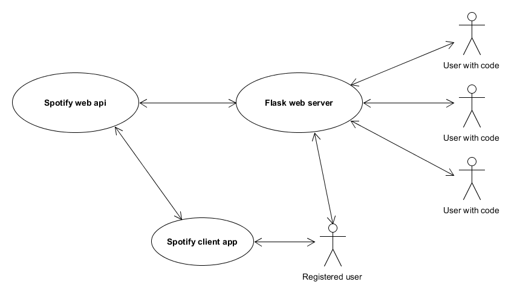

# Spotify party player

## Flask web server

- Centrally hosted web server with website
- Login using Spotify web api oAuth2

## User Story

1) User **A** signs in to the web server with Spotify oAuth2
1) User **A** creates a private room **R** marked by unique token
1) User **A** shares the token or link to the room **R** with user **B**
1) User **B** connects to the room **R** with token or link provided by user **A**
1) Any user in the room **R** can search for tracks and add them to queue
1) All songs are then played in the Spotify client of user **A**
1) Users present in room **R** can then vote to skip or move tracks
1) User **B** removes the room **R**

## Technology

- Flask (server)
- SocketIO (updates)
- spotify (communication with spotify web api)
